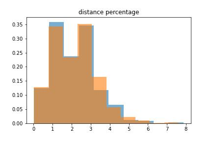

\newcommand{\noin}{\noindent}    
\newcommand{\Var}{\text{Var}}    
\newcommand{\Cov}{\text{Cov}}  

# Baseline Model

## Visualization
In this section we will aim to build a very simple model to analyze the relationship between ride distance and ride price. As is stated earlier, we didn't use the entire dataset because it is too slow to process them all in R. So we randomly sampled $10\%$ of the observations and use the downsampled version in the subsequent model building and analysis. We will start with some simple visualizations to explore the relationship between ride price and ride distance.

```{r, eval=T, cache=T}
# read the data
rideshare = read.csv("data/sampled_rideshare.csv")

# drop rows with price being NA
rideshare = rideshare[is.na(rideshare$price) == F & is.na(rideshare$cab_type) == F, ]

# train / test split
rideshare.train = rideshare[1:40000, ]
rideshare.test = rideshare[40001:45984, ]

# scatter plot for ride price vs ride distance
plot(price ~ distance, data=rideshare.train, cex=0.4)
```

From the scatter plot we can see there is a positive relationship between ride distance and price, although we can see that the variability of the response at the same predictor value is fairly big, and we can expect that the $R^2$ for a simple linear model would not be very ideal.

## Simple Linear model
The next step is to actually fit a simple linear regression model and check the assumptions for simple linear regression. We call it `lm.simple`.

```{r, eval=T, cache=T}
RMSE = function(y, yhat) {
  return (mean((y - yhat) ^ 2))
}

lm.simple = lm(price ~ distance, data=rideshare.train)

# model summary
summary(lm.simple)

# RMSE, which can also be calculated via residual standard error and dF
y.pred.train = predict(lm.simple)
y.pred.test = predict(lm.simple, newdata=rideshare.test)
lm.simple.train.rmse = RMSE(rideshare.train$price, y.pred.train)
lm.simple.test.rmse = RMSE(rideshare.test$price, y.pred.test)

# print out the RMSE result
data.frame(trainRMSE=lm.simple.train.rmse, testRMSE=lm.simple.test.rmse)
```

From the point estimates we can make the rough interpretation: first, the intercept is $10.36$, indicating that a "starting price" would be aroun 10.36 dollar, even if it's a super short ride; second, the slope for the `distance` $is 2.83$ meaning that every 1 mile would be estimated to cost you 2.82 dollar more in general cases. The $p$-value for the slope is less than $2\times 10^{-16}$, so we can say that the association is very very significant.

$R^2$ is roughly 0.1189. It's rather distant from 1. It means that nearly $90\%$ of the variability is due the residual errors. We get a pretty high RMSE. This is not surprising as we expect more factors aside from sheer distance would affect the price as we learned they are considered into the pricing model. Also, we notice that the test RMSE is not significantly higher than that of the training, so the model is not overfitting at all (which is also within our expectation, as the model is rather simple and has a very low variance).

Further more we plot the prediction line to see if it matches the scatter plot we created before.

```{r, eval=T}
x.plot = seq(0, 8, 0.1)
y.pred.plot = predict(lm.simple, newdata=data.frame(distance=x.plot))
plot(price ~ distance, data=rideshare.train, cex=0.4)
lines(x.plot, y.pred.plot, col="blue", lwd=4)
```

Next we check the assumptions for this linear model and see if we would need any transformations to relieve the skewness issue.

```{r, eval=T}
# residual and QQ plot
par(mfrow=c(2, 2))
plot(lm.simple, which=1:2, cex=0.5)

# y distribution plot
hist(rideshare.train$price)
```
According to the residual plot, the linearity and constant variance assumption are all poorly conformed. There a lot more positive residuals than negative ones, so `lm.simple` is underestimating the prices. The variability of residuals seem greater when the predicted prices are within range $[18, 23]$. From the QQ plot and the histogram we can see that the normality is also not met. The data looks quite right-skew, and slightly bi-modal.

## Polynomial Regression

Since the linear model has a relatively not so satisfying performance, and the linearity is not well met, we think it might be worth a try to use polynomial model. We want to start with a quadratic model

```{r, eval=T, cache=T}
lm.quadratic = lm(price ~ poly(distance, 2, raw=T), data=rideshare.train)

# quadratic model summary
summary(lm.quadratic)

# F-test
anova(lm.simple, lm.quadratic)
```
From the $p$-values from both the $t$-test of the quadratic term and the $F$-test between `lm.simple` and `lm.quadratic` we can see that the added quadratic term is not of much help, so we will not further more consider it.

## Uber or Lyft?

Here we want to research into a very intriguing question: is Uber and Lyft exhibiting different pricing models? To answer this question, we will experiment with another linear model incorporating the type of the ride into the consideration. We call this model `lm.brand`. It considers the `distance` and `cab_type`, as well as their interaction

```{r, eval=T}
lm.brand = lm(price ~ (distance + cab_type) ^ 2, data=rideshare.train)
summary(lm.brand)

# compare this to the simple model
anova(lm.simple, lm.brand)

# RMSEs
y.pred.brand.train = predict(lm.brand)
y.pred.brand.test = predict(lm.brand, newdata=rideshare.test)
lm.brand.train.rmse = RMSE(rideshare.train$price, y.pred.brand.train)
lm.brand.test.rmse = RMSE(rideshare.test$price, y.pred.brand.test)
data.frame(trainRMSE=lm.brand.train.rmse, testRMSE=lm.brand.test.rmse)
```

From the summary of the model we can derive some useful insights. When `cab_type` is `Lyft`, the regression formula is $$\text{price} = 10.28 + 3.25\times\text{distance}$$; While if `cab_type` is `Uber`, the regression formula is $$\text{price}=10.33 + 2.51\times distance$$. This suggests that `Lyft` have a slightly lower starting price but would have a significantly higher fare rate w.r.t the distance compared to Uber rides. The pricing model for these two companies are in fact quite different. The $t$-test result supports this claim: the coefficients for `cab_typeUber` is not significant with a $p$-value as big as 0.791, while the coefficients for `distance:cab_typeUber` has a $p$-value less than $2\times 10^{-16}$, indicating extreme significance. So we would have the impression that in Boston during 2018 in the winter, Lyft would be more expensive generally if we are only considering the distance.

To explore whether this is an improvement compared to the naive linear regression, we perform an $F$-test and calculated the RMSEs. The $p$-value for the $F$-test is less than $2.2\times 10^{-16}$, suggesting a significant improve. Also both train & test RMSEs are better compared to `lm.simple`.

Next, we will provide some visualizations to support this intuition. We will plot the scattered points as well as the prediction line, but in different colors to separate these two cab brands: pink for Lyft, and Orange for Uber.

```{r, eval=T}
par(mfrow=c(1,2))
rideshare.train.uber = rideshare.train[rideshare.train$cab_type=="Uber", ]
rideshare.train.lyft = rideshare.train[rideshare.train$cab_type=="Lyft", ]

# Uber plot
plot(price ~ distance, data=rideshare.train.uber, col="orange", cex=0.4, pch=8,  xlim=c(0, 8), ylim=c(0, 100), main="Uber")
y.pred.plot.uber = predict(lm.brand, newdata=data.frame(distance=x.plot, cab_type=rep("Uber", length(x.plot))))
lines(x.plot, y.pred.plot.uber, col="black", lwd=4)

# Lyft plot
plot(price ~ distance, data=rideshare.train.lyft, col="pink", cex=0.4, xlim=c(0, 8), ylim=c(0, 100), main="Lyft")
y.pred.plot.lyft = predict(lm.brand, newdata=data.frame(distance=x.plot, cab_type=rep("Lyft", length(x.plot))))
lines(x.plot, y.pred.plot.lyft, col="Magenta", lwd=4)
```
From the prediction line we can see that Lyft has a steeper prediction line, suggesting a significant higher fare rate. However, according to the scatter plots, we can easily find that Uber ride fares have better linearity w.r.t the ride distance, and has a smaller variance in the price.

# Other Explorations

## Downsample Distribution
Since the original dataset is too big to process in R, we downsample the dataset to a smaller dataset. However, we'd like to make sure the distribution of the smaller dataaset is similar to the original dataset.

{height=2in} 

{height=2in} 

{height=2in} 

{height=2in} 


{height=2in} 

{height=2in} 


It seems that the downsampling distribution is pretty similar to the original one besides the price distribution, which is a little bit off. We might want to adjust this in the future. 


## Evaluation of number of orders within the same range

It's intuitive for Uber/Lyft to use supply and demand to price the rides. Therefore, the price of the rides might be much higher if there are a lot of demands. We did some data preprocessing in python by calculating the number of rides within certain time intervals (15 mins here). If there are a lot of rides in the same time range, we expect the price of the rides will be higher. 

```{r, eval = T}
slide_window_df = read.csv("./data/rides_slide_window.csv")
hist(slide_window_df$number_of_orders_within_15_mins)
```

Based on the histogram, it seems that the number of rides is not very continuous. However, we could certainly see that there are certain time ranges (peak hours) with a lot of more rides. Since the value is not very continuous, it might be helpful to convert them into categorical variables based on some time ranges or use a decision tree model in the future. 

```{r, eval = T}
rideshare$busy = as.factor(
    ifelse(rideshare$number_of_orders_within_15_mins < 500, 
            "not busy", 
            ifelse(rideshare$number_of_orders_within_15_mins < 1000, 
            "normal", 
            "busy")))
```

```{r, eval = T}
boxplot(rideshare$price ~ rideshare$busy)
```
```{r, eval = T}
summary(aov(rideshare$price ~ rideshare$busy))
```
Based on the boxplot and the anova result, there is no significant difference between the price and the number of orders in the same time range. This is counter-intuitive. It might due to the data generation process. The data provider might presample some data to make each hour contains similar amount of orders. Since it does not represent the true distribution, then our calculation might be misleaded. 

```{r, eval = T}
hist(rideshare$hour)
```


