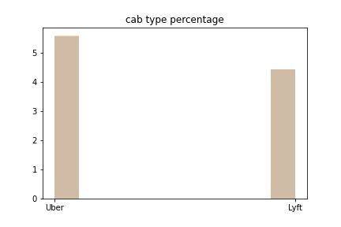

### Downsample Distribution
Since the original dataset is too big to process in R, we downsample the dataset to a smaller dataset. However, we'd like to make sure the distribution of the smaller dataaset is similar to the original dataset.

{height=2in} 
{height=2in} 

{height=2in} 

{height=2in} 


{height=2in} 

{height=2in} 


It seems that the downsampling distribution is pretty similar to the original one besides the price distribution, which is a little bit off. We might want to adjust this in the future. 


\newpage

### Evaluation of number of orders within the same range

It's intuitive for Uber/Lyft to use supply and demand to price the rides. Therefore, the price of the rides might be much higher if there are a lot of demands. We did some data preprocessing in python by calculating the number of rides within certain time intervals (15 mins here). If there are a lot of rides in the same time range, we expect the price of the rides will be higher. 

```{r, eval = T}
slide_window_df = read.csv("./rides_slide_window.csv")
hist(slide_window_df$number_of_orders_within_15_mins)
```

Based on the histogram, it seems that the number of rides is not very continuous. However, we could certainly see that there are certain time ranges (peak hours) with a lot of more rides. Since the value is not very continuous, it might be helpful to convert them into categorical variables based on some time ranges or use a decision tree model in the future. 

```{r, eval = T}
df = read.csv("./sampled_rideshare.csv")
df$busy = as.factor(
    ifelse(df$number_of_orders_within_15_mins < 500, 
            "not busy", 
            ifelse(df$number_of_orders_within_15_mins < 1000, 
            "normal", 
            "busy")))
```

```{r, eval = T}
boxplot(df$price ~ df$busy)
```
```{r, eval = T}
summary(aov(df$price ~ df$busy))
```
Based on the boxplot and the anova result, there is no significant difference between the price and the number of orders in the same time range. This is counter-intuitive. It might due to the data generation process. The data provider might presample some data to make each hour contains similar amount of orders. Since it does not represent the true distribution, then our calculation might be misleaded. 

```{r, eval = T}
hist(df$hour)
```
